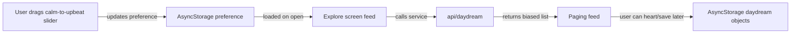

## MVP Features
- Scroll videos
- Choose music moods and video themes
- Swap music
- Save DDs and/or individual video/music to favorites

## Goal
Make the app feel "music-first" with a persistent calm <-> upbeat control, then evolve from saving IDs to saving full daydream objects (video + track combo) locally.

## Current state (from repo)
- Swiping/paging feed lives in `[app/(tabs)/index.tsx](app/%28tabs%29/index.tsx)`, using a vertically paged `FlatList`.
- The feed is driven by `[api/daydream.ts](api/daydream.ts)`, where each `DaydreamItem` already pairs `videoSource` and a `song`.
- "Saved" right now is only a heart toggle that stores IDs (`videoId-audioId`) in AsyncStorage (`@daydreaming/saved`).
- `[app/(tabs)/saved.tsx](app/%28tabs%29/saved.tsx)` is still a placeholder.

## UX + behavior decisions
- Swipe remains paired (music changes with the video) per your choice.
- MVP priority order: implement mood slider + persistence first (then saving objects).

## Design sketch
Mermaid (data flow):

## Todo implementation plan
1. Mood model + persistence (local only)
   - Add a mood value to AsyncStorage (e.g. `@daydreaming/moodValue`), loaded in `[app/(tabs)/index.tsx](app/%28tabs%29/index.tsx)` on startup.
   - Implement a simple calm <-> upbeat UI slider overlay (small, non-modal). Keep it minimal to preserve the "one entry point" feel.

2. Bias swiping with mood (paired swipe)
   - Extend `[api/daydream.ts](api/daydream.ts)`:
     - Add a numeric mood axis to `SongTrack` (e.g. `calmness: number` from 0..1).
     - Update the mock data builder so every `DaydreamItem` has a track with a `calmness`.
   - Update `getFeatured()` to return a list ordered/bucketed by closeness to the user's `moodValue`.
     - Minimal viable approach: filter to top-K closest tracks and pair them with local videos in a stable round-robin, then fill the remainder.

3. Suggestions bias (later in MVP polish)
   - Use the same mood value when generating `getRandomDaydream()` or when handling "shuffle next song" from the UI.

4. "Saved daydream objects" upgrade (after mood is solid)
   - Replace ID-only storage with an object model persisted to AsyncStorage (e.g. `@daydreaming/saved_v2`).
   - Define a serializable daydream shape (must be local-only, so it should use IDs + timestamps):
     - `videoId`, `audioId`, `savedAt`, optional `label`.
   - In `[app/(tabs)/index.tsx](app/%28tabs%29/index.tsx)`, update `toggleSave(item)` to add/remove the object.
   - In `[app/(tabs)/saved.tsx](app/%28tabs%29/saved.tsx)`, render saved daydreams and allow tapping an item to play it (at minimum: navigate back to Explore and scroll/present the matching pair).

5. Collections + "morning" folder (MVP next)
   - Add optional `collectionId`/`collectionName` to the daydream object.
   - Implement a default `morning` collection and a shuffle action that composes combos from the stored daydreams.

## Files to change (first pass)
- `[app/(tabs)/index.tsx](app/%28tabs%29/index.tsx)`
  - Load/save mood preference.
  - Add slider UI and pass mood value into feed logic.
  - Keep heart toggle logic working while we transition storage in a later step.
- `[api/daydream.ts](api/daydream.ts)`
  - Add mood metadata to tracks.
  - Update `getFeatured`/`getNextSong` logic to bias by mood.
- `[app/(tabs)/saved.tsx](app/%28tabs%29/saved.tsx)`
  - Implement saved daydream list UI after mood slider lands.

## Acceptance criteria (MVP)
- User can adjust calm <-> upbeat; preference persists across app restarts.
- Swiping feed order responds to the mood value (more calm tracks for low values, more upbeat for high values).
- Heart/save continues to work (even if Saved tab is upgraded in the next iteration).

